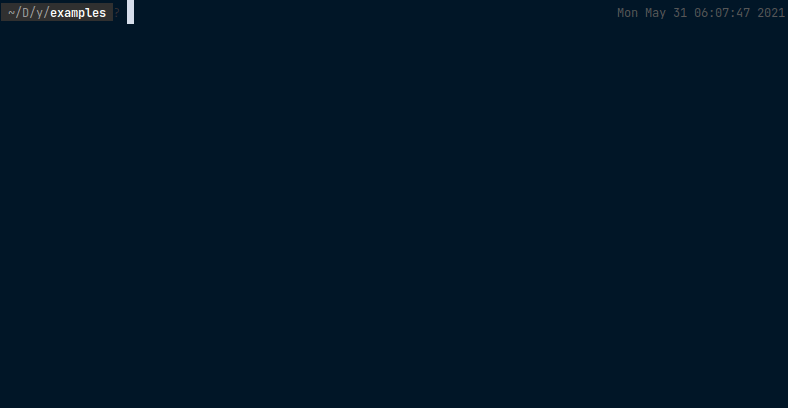

# Yester

### A YAML based API test runner.

**Blazing Fast Runner**: Executes tests in parallel, using goroutines \
**Integrated Scripting**: Supports custom javascript validations from the YAML config \
**Organized Output**: Splits output by directory when testing multiple packages/services at once




# Example

```yaml
base: https://petstore.swagger.io/v2 # root api url

tests:
  getInventory: # title
    request:
      method: GET
      path: /store/inventory
      headers:
        accept: application/json
    validation:
      statuscode: 200
      headers:
        content-type: application/json
      body: # the response is available as `body`
        - body.available > 500
        - body.sold > 0
        
        # full JS support
        - typeof body.pending == 'number'

# ...
```

# Goals

- **Easy Configuration**

  It should be possible to write sophisticated tests quickly, with little effort and little code/config.

- **Reasonably Powerful Validation**
  
  It should be easy to validate things like status codes, headers, and the shape of responses.

- **Useful Output**
  
  The test runner should show useful summary information efficiently and compactly.
  For tests that fail, it should show the exact reason(s) it failed, and as many as possible, instead of spoon-feeding
  one at a time.

- **Efficient Test Runner**
  
  At no point during testing should users be waiting on the test runner itself. Further, the runner should
  use the system's resources to test as efficiently as possible.

# Future Ideas

- Benchmarking support, potentially with the help of existing tools like `wrk`.

# Contributing

Contributions are welcome, but please open an issue describing your idea and rough implementation plans before
opening a PR. Thanks!

# TODO

- [ ] Allow tests to be marked as depending on another, and run them sequentially
- [ ] CLI: Verbose option to include passing tests in output
- [ ] CLI: Specify specific file/directory to run
- [ ] CLI: Help option, especially after other flags are implemented
- [ ] CLI: Version option would be nice
- [ ] DX: Make installing super easy across all major platforms
- [ ] Misc: Make these Github issues instead of blabbing on the README lol